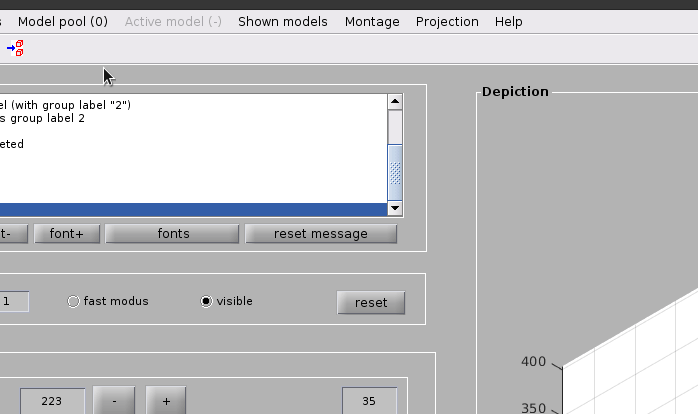

# Dipoles to vesicles

## Overview
This mini-tutorial will show you how to quickly and easily generate an oversampled set of positions
and orientations on a spherical supporting geometry (such as a vesicle) in `Dynamo`

## Motivation
Vesicle models in `Dynamo` are spheres or ellipsoids fit to a point cloud, 
this is robust but increases the time spent on annotation.

Spheres are uniquely defined by a center point and a radius. 
Center and edge points of a vesicle in a tomogram are easily annotated using the `dipoleSet` model type.

## Prerequisites
- a `Dynamo` catalogue containing your tomograms

## Create a `dipoleSet` model
1. open your tomogram in `dtmslice` from the `dcm` (`Dynamo` catalogue manager) GUI
   `View volume -> Full tomogram file in tomoslice`
2. create a `dipoleSet` model from the menu
   `Model pool -> Create new model in pool (choose type) -> Oriented particles (dipole set)`
   

## Annotate your vesicles

### `dtmslice` controls
#### General

#### `dipoleSet` specific

