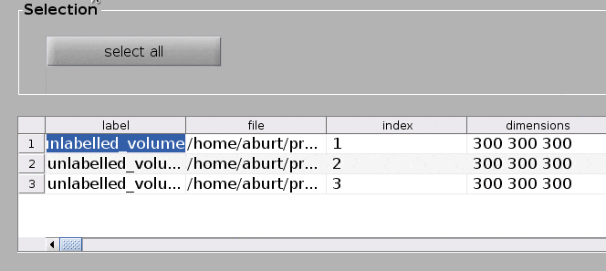
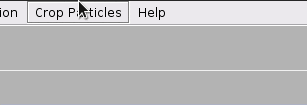
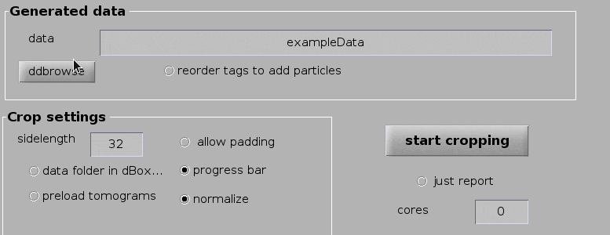

# Extracting particles from a catalogue

This mini-tutorial will explain how to extract a set of particles from multiple tomograms in a `Dynamo` catalogue.

## Prerequisites
- a `Dynamo` catalogue containing your tomograms
- [models](https://wiki.dynamo.biozentrum.unibas.ch/w/index.php/Model) for the particles you wish to extract saved in the catalogue

If you have been picking your particles/supporting geometries in `dtmslice`, opened from the catalogue manager (`dcm`) then you're ready to go!

## Open the catalogue
Open your catalogue in `dcm`

## Select your tomograms
Select the tomograms you would like to crop from (or use the select all button)
   


## Open the volume list manager
The volume list manager can create volume list (`.vll`) files containing the information needed for cropping particles.

Open the volume list manager from the `Crop particles` menu at the top of the `dcm` window.



## Create a volume list file
Create a volume list (`.vll`) file by 
- picking the models from which you want to crop in the GUI 
- hitting the `create list` button.
   


## Extract your particles
```{sidebar} Dynamo data folder structure
A Dynamo data folder contains
- Subvolumes for each particle
- Alignment metadata for each particle (`crop.tbl`)
- A tomogram-table map [file](https://wiki.dynamo.biozentrum.unibas.ch/w/index.php/Tomogram-table_map_file) (`indices_column20.doc`)
```

In the `Particle extraction` GUI which pops up
- set the particle sidelength to your desired box size
- hit `crop particles`. 

This will generate a `Dynamo` format data folder in the current directory with the name in the `data` box.



```{note}
We use the *data folder in dBoxes...* option here to avoid problems with having thousands of files in the same directory.
Read more [here](https://wiki.dynamo.biozentrum.unibas.ch/w/index.php/Generic_data_containers).
```

You now have a `Dynamo` format data folder containing your particles, you're ready for refinements!
